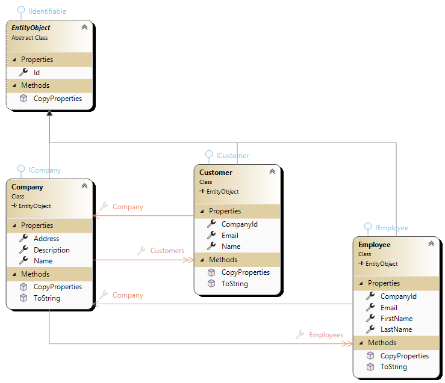

# CompanyManager With SQLITE

**Lernziele:**

- Wie mit dem **CodeFirst** Ansatz eine Datenbank erstellt wird.
- Die Verknüpfung von Datenstrukturen und Datenbanken verstehen.
- Wie **SQLite** als Datenbank mit dem EntityFramework verwendet wird.
- Wie **Einschränkungen** (Constraints) in einer Datenbank definiert werden.

**Hinweis:** Als Startpunkt wird die Vorlage [CompanyManager](https://github.com/leoggehrer/CompanyManager-Template) verwendet.

## Beschreibung der Vorlage

Den Aufbau und die Beschreibung der Vorlage finden Sie [hier](https://github.com/leoggehrer/CompanyManager-Template).

## Vorbereitung

Bevor mit der Umsetzung begonnen wird, sollte die Vorlage heruntergeladen und die Funktionalität verstanden werden.

### Packages installieren

Um mit dem EntityFramework zu arbeiten, müssen die folgenden Packages installiert werden:

- **CompanyManager.Logic**
  - Microsoft.EntityFrameworkCore*
  - Microsoft.EntityFrameworkCore.Sqlite**
- **CompanyManger.ConApp**
  - Microsoft.EntityFrameworkCore.Tools***

Abhängig von der IDE kann dies über die Konsole oder über die GUI erfolgen. Sie finden eine Anleitung zum Installieren von Nuget-Packages [hier](https://github.com/leoggehrer/Slides/tree/main/NugetInstall).

*...Das ist die Basis-Bibliothek für den EntityFramework und muss immer inkludiert werden.
**...Erweiterung zur Basis-Bibliothek für die Verwendung von SQLite.
***...Diese Package ist für die Erstellung und Aktualisierung der Datenbank erforderlich.

### Erstellen der Entitäten

Entitäten sind Objekte oder Klassen, die eine eindeutige Identität besitzen und in einer Datenbank gespeichert werden können. Sie repräsentieren reale Objekte oder Konzepte aus der Anwendungsdomäne, wie z.B. Kunden, Bestellungen oder Produkte. In der objektorientierten Programmierung und im Entity Framework werden Entitäten verwendet, um Datenbanktabellen zu modellieren.

In einem *Entity Framework Kontext* sind Entitäten Klassen, die die Struktur der Datenbanktabellen definieren. Jede Instanz einer Entität entspricht einer Zeile in der entsprechenden Tabelle. Entitäten enthalten Eigenschaften, die den Spalten der Tabelle entsprechen, und können Beziehungen zu anderen Entitäten haben.

1. Erstellen des Ordners **Entities**
Dieser Ordner wird im Projekt *CompanyManager.Logic* erstellt.
2. Erstellen der Entitäten **Company**, **Customer** und **Employee** im Ordner *Entities*.
Diese Entitäten müssen die entsprechende Schnittstelle aus dem Ordner **Contracts** implementieren.

Nachfolgend ein Beispiel für die **Company**-Entität:

```csharp
/// <summary>
/// Represents a company entity.
/// </summary>
public class Company : EntityObject, ICompany
{
    #region properties
    /// <summary>
    /// Gets or sets the name of the company.
    /// </summary>
    public string Name { get; set; } = string.Empty;

    /// <summary>
    /// Gets or sets the address of the company.
    /// </summary>
    public string? Address { get; set; }

    /// <summary>
    /// Gets or sets the description of the company.
    /// </summary>
    public string? Description { get; set; }
    #endregion properties

    #region methods
    /// <summary>
    /// Returns a string representation of the company.
    /// </summary>
    /// <returns>A string that represents the company.</returns>
    public override string ToString()
    {
        return $"Company: {Name}";
    }
    #endregion methods
}
```

Diese Implementierung kann als Vorlage für die anderen Entitäten verwendet werden.

**Erläuterung:**

Die abstrakte Klasse `EntityObject` ist die Basisklasse für alle Entitäten. Sie beinhaltet die Eigenschaft `Id` (diese Eigenschaft müssen alle Entitäten bereitstellen) und eine Methode `public virtual void CopyProperties(IIdentifiable other)`.
Die Klasse **Company** erbt die Eigenschaften und Methoden der Klasse `EntityObject` und ergänzt diese um weitere Eigenschaften und Methoden. Die Methoden `public virtual void CopyProperties(ICompany company)`und das Überschreiben der Methode `public override ToString()` ist für die Entität nicht erforderlich, sind aber im Verlauf für die weitere Entwicklung hilfreich.

Fügen Sie zusätzlich zu den Entitäten die **Navigationseigenschaften** hinzu. Nachfolgend ein Beispiel für die **Company**-Entität:

```csharp
/// <summary>
/// Represents a company entity.
/// </summary>
public class Company : EntityObject, ICompany
{
    ...
    #region navigation properties
    /// <summary>
    /// Gets or sets the list of customers associated with the company.
    /// </summary>
    public List<Customer> Customers { get; set; } = [];
    /// <summary>
    /// Gets or sets the list of employees associated with the company.
    /// </summary>
    public List<Employee> Employees { get; set; } = [];
    #endregion navigation properties
    ...
}
```

Die Navigationseigenschaften müssen in allen Entitäten definiert werden und die entsprechenden Entitäten referenzieren. Alle Informationen zu Navigationseigenschaften finden Sie in der folgenden Tabelle:

| Komponente        | Relation | Komponente |
| ----------------- | -------- | ---------- |
| **Company**       | 1:n      | Customer   |
| **Company**       | 1:n      | Employee   |
| **Customer**      | 1:1      | Company    |
| **Employee**      | 1:1      | Company    |

Das vollständige *Entity-Objectmodell* ist in der nachfolgenden Abbildung abgebildet:



#### Attribute den Entitäten hinzufügen

Attribute bei Entitäten sind essenziell, um die spezifischen Eigenschaften oder Merkmale der Entitäten in einem Datenmodell zu beschreiben. Sie liefern zusätzliche Informationen, die notwendig sind, um die Entitäten eindeutig zu identifizieren, ihre Eigenschaften zu speichern und ihre Beziehungen zu anderen Entitäten zu definieren. Weitere Informationen zu Attributen finden Sie [hier](https://www.learnentityframeworkcore.com/configuration/data-annotation-attributes).

Die Schlüsseleigenschaft der Entität ist in der Klasse `EntityObject` definiert und kann daher mit dem Attribute `Key` ergänzt werden.

```csharp
  /// <summary>
  /// Represents an abstract base class for entities with an identifier.
  /// </summary>
  public abstract class EntityObject : IIdentifiable
  {
      /// <summary>
      /// Gets or sets the identifier of the entity.
      /// </summary>
      [System.ComponentModel.DataAnnotations.Key]
      public int Id { get; set; }
      ...
  }
```

**Erläuterung:** Das Setzen des Attributs `Key` kann entfallen. Die Default-Benennung der Identität ist `Id` oder der Klassenname gefolgt von `Id` (EntityObjectId).

Nachfolgend ein Beispiel für die **Company**-Entität:

```csharp
/// <summary>
/// Represents a company entity.
/// </summary>
[System.ComponentModel.DataAnnotations.Schema.Table("Companies")]
[Index(nameof(Name), IsUnique = true)]
public class Company : EntityObject, ICompany
{
    #region properties
    /// <summary>
    /// Gets or sets the name of the company.
    /// </summary>
    [System.ComponentModel.DataAnnotations.Required]
    [System.ComponentModel.DataAnnotations.MaxLength(256)]
    public string Name { get; set; } = string.Empty;

    /// <summary>
    /// Gets or sets the address of the company.
    /// </summary>
    [System.ComponentModel.DataAnnotations.MaxLength(1024)]
    public string? Address { get; set; }

    /// <summary>
    /// Gets or sets the description of the company.
    /// </summary>
    [System.ComponentModel.DataAnnotations.MaxLength(2048)]
    public string? Description { get; set; }
    #endregion properties

    #region navigation properties
    /// <summary>
    /// Gets or sets the list of customers associated with the company.
    /// </summary>
    public List<Customer> Customers { get; set; } = [];
    /// <summary>
    /// Gets or sets the list of employees associated with the company.
    /// </summary>
    public List<Employee> Employees { get; set; } = [];
    #endregion navigation properties

    #region methods
    /// <summary>
    /// Returns a string representation of the company.
    /// </summary>
    /// <returns>A string that represents the company.</returns>
    public override string ToString()
    {
        return $"Company: {Name}";
    }
    #endregion methods
}
```

| Attribut | Beschreibung |
|----------|--------------|
| **Table** | Mit dem Table-Attribut kann der Name der Tabelle in der Datenbank definiert werden. Wenn das Attribut nicht gesetzt wird, wird der Name der Tabelle automatisch aus dem Klassennamen abgeleitet. Der Parameter `IsUnique = true` gibt an, dass die Werte eindeutig sein müssen. |
| **Index** | Das Attribut gibt an, dass die Eigenschaft ein Index ist. Mit dem Attribut kann ein Index auf einer oder mehreren Eigenschaften definiert werden. |
| **Required** | Das Attribut gibt an, dass die Eigenschaft einen Wert haben muss. |
| **MaxLength** | Das Attribut gibt die maximale Länge der Eigenschaft an. |

Fügen Sie die Attribute zu den anderen Entitäten hinzu. Die Informationen über Längen usw. finden Sie in der Beschreibung der Vorlage.

### Erstellen des DataContext

Der **DbContext** ist die Hauptklasse, die mit der Datenbank kommuniziert. Es ist eine Kombination aus Unit of Work und Repository-Mustern. Es kann als eine Sammlung von Entitäten betrachtet werden, die in einer Datenbank gespeichert sind. Der **DbContext** ist verantwortlich für das Abrufen, Speichern, Aktualisieren und Löschen von Entitäten aus der Datenbank.

Erweitern Sie die vorhandene Schnittstelle `IContext` um folgende Eigenschaften:

```csharp
public interface IContext : IDisposable
{
    DbSet<Entities.Company> CompanySet { get; }
    DbSet<Entities.Customer> CustomerSet { get; }
    DbSet<Entities.Employee> EmployeeSet { get; }

    int SaveChanges();
}
```

Im nächsten Schritt wird die Kontext-Klasse erstellt. Wir nennen die Klasse `CompanyContext` und erweitern sie um die Klasse `DbContext` aus dem Namespace `Microsoft.EntityFrameworkCore`.

```csharp
internal class CompanyContext : DbContext, IContext
{
    #region fields
    private static string ConnectionString = "data source=CompanyManager.db";
    #endregion fields

    public DbSet<Entities.Company> CompanySet { get; set; }
    public DbSet<Entities.Customer> CustomerSet { get; set; }
    public DbSet<Entities.Employee> EmployeeSet { get; set; }

    protected override void OnConfiguring(DbContextOptionsBuilder optionsBuilder)
    {
        optionsBuilder.UseSqlite(ConnectionString);

        base.OnConfiguring(optionsBuilder);
    }
}
```

Überschreiben Sie in der Klasse `CompanyContext` die Methode `OnConfiguring`, um die Verbindung zur Datenbank herzustellen. In diesem Fall wird die Datenbank **SQLite** verwendet. Die Verbindungsinformationen werden in der statischen Variable `ConnectionString` gespeichert.

### Erstellen der Datenbank

Das Erstellen der Datenbank erfolgt über den **CodeFirst**-Ansatz. Dies bedeutet, dass die Datenbank aus den Entitäten erstellt wird. Der **DbContext** ist für das Erstellen und Aktualisieren der Datenbank verantwortlich. Die einzelnen Schritte sind von der verwendeten IDE abhängig. Eine Anleitung zum Erstellen der Datenbank finden Sie [hier](https://github.com/leoggehrer/Slides/tree/main/EFCreateDatabase).

### Erstellen der Factory-Klassen

Für den Zugriff auf den Database-Kontext wird eine Factory-Klasse benötigt. Erstellen Sie die Klasse `Factory` im Ordner *DataContext*.

```csharp
/// <summary>
/// Factory class to create instances of IMusicStoreContext.
/// </summary>
public static class Factory
{
    /// <summary>
    /// Creates an instance of IContext.
    /// </summary>
    /// <returns>An instance of IContext.</returns>
    public static IContext CreateContext()
    {
        var result = new CompanyContext();

        return result;
    }
#if DEBUG
        /// <summary>
        /// Creates the database for the CompanyContext.
        /// </summary>
        public static void CreateDatabase()
        {
            var context = new CompanyContext();

            context.Database.EnsureDeleted();
            context.Database.EnsureCreated();
        }

        public static void InitDatabase()
        {
            var path = Path.GetDirectoryName(System.Reflection.Assembly.GetExecutingAssembly().Location)!;
            var context = CreateContext();

            CreateDatabase();

            var companies = DataLoader.LoadCompaniesFromCsv(Path.Combine(path, "Data", "companies.csv"));

            companies.ToList().ForEach(e => context.CompanySet.Add(e));
            context.SaveChanges();

            var customers = DataLoader.LoadCustomersFromCsv(Path.Combine(path, "Data", "customers.csv"));
            customers.ToList().ForEach(e => context.CustomerSet.Add(e));

            var employees = DataLoader.LoadEmployeesFromCsv(Path.Combine(path, "Data", "employees.csv"));
            employees.ToList().ForEach(e => context.EmployeeSet.Add(e));

            context.SaveChanges();
        }
#endif
}
```

#### Systemstruktur

Die aktuelle Struktur des Systems ist in der folgenden Abbildung zusammengefasst:


### Testen des Systems

Das Konsolenprogramm enthält ein Testmenü zum Testen der Funktionalität für die Entitäten **Company**, **Customer** und **Employee**. Implementieren Sie die Methoden welche noch nicht fertig gestellt sind. Sie erkennen die unvollständigen Methoden mit dem Inhalt:

```csharp
    throw new NotImplementedException();
```

Fügen Sie das Package `System.Linq.Dynamic.Core` hinzu, um Zeichenfolgen (strings) in LINQ-Abfragen zu verwenden. Das Hinzufügen des Packages erfolgt im Konsolen-Programm und die Anleitung dazu finden Sie [hier](https://github.com/leoggehrer/Slides/tree/main/NugetInstall).

## Hilfsmittel

- Foliensätze

## Abgabe

- Termin: 1 Woche nach der Ausgabe
- Klasse:
- Name:

## Quellen

- keine Angabe

> **Viel Erfolg!**
